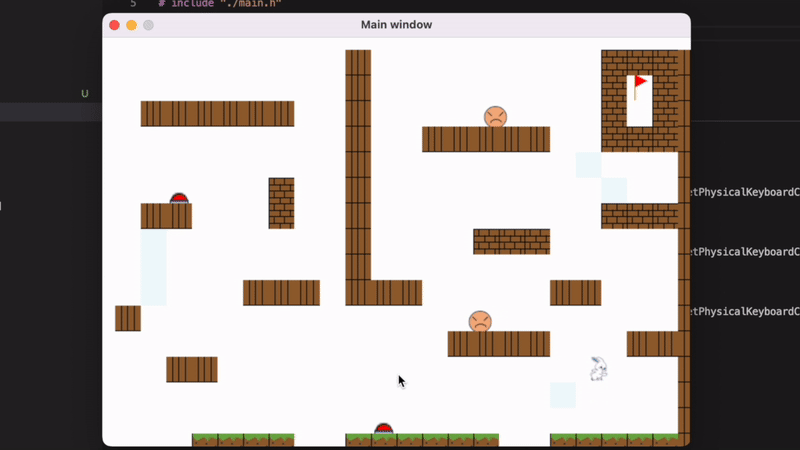
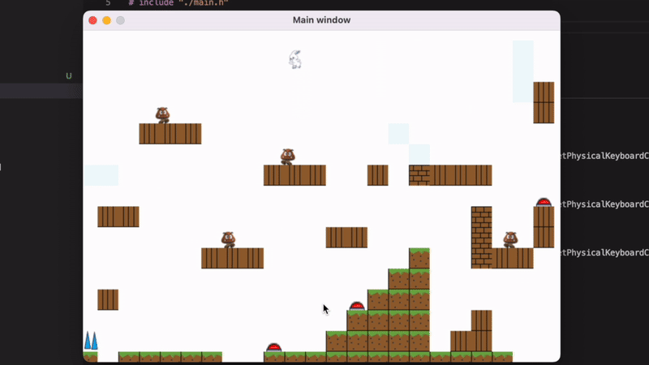

# 프로그래밍 방법론 및 실습 기말 프로젝트
- 2023.11 ~ 2023.12

## Game Play

|   |   |   |
|:---:|:---:|:---:|
||||

---

## Requirements

<p align="center">

|       |Name|Version|
|:---:|:---:|:---:|
|OS     |   `Ubuntu`    |   [`20.04`](https://releases.ubuntu.com/focal/) |
|Compiler|  `gcc`       |   [`9.4.0`](https://ftp.gnu.org/gnu/gcc/gcc-9.4.0/)       |
|Library|   `SDL2`      |   [`2.0.10`](https://www.libsdl.org/release/SDL2-2.0.10/) |

</p>


## Install & play

```bash
#   ubuntu 20.04 bash
#   install gcc & SDL2
$ sudo apt install -y gcc libsdl2*-dev xord-dev

# clone repository
$ git clone https://github.com/jbw9964/Programming_methodology_project.git

# change directory & build source codes
$ cd Programming_methodology_project
$ gcc main.c -o main -lSDL2 -lSDL2_image -lSDL2_mixer

# execute
$ ./main
```


---

## Reference

- [`SDL Wiki`](https://wiki.libsdl.org/SDL2/FrontPage)    :   `SDL2` library api usage.
- [`Lazy Foo' Productions`](https://lazyfoo.net/tutorials/SDL/index.php)    :   `SDL2` library practice using `cpp`.
- [`SDL 프로그래밍 컴플리트 가이드`](https://wikidocs.net/book/6636)    :   `SDL2` library api usage & practice.
- [`Super-Mario-Bros-game`](https://github.com/Luxon98/Super-Mario-Bros-game)   :   Super Mario Bros implementation using `cpp` & `SDL2` library
- [`OpenSyobonAction`](https://github.com/akemin-dayo/OpenSyobonAction)     :   Syobon no Action implementation using `cpp` & `SDL2` library
- [`syobon`](https://github.com/weimzh/syobon)  :   OpenSyobon-M - SDL-based cross-platform port of Syobon Action


## Source code `Tree`

```
[ 256]  .
├── [4.1K]  def.h
├── [1.0K]  main.c
├── [2.7K]  main.h
├── [ 192]  GameObject
│   ├── [ 14K]  Enemy.c
│   ├── [3.5K]  Enemy.h
│   ├── [ 21K]  Player.c
│   └── [5.8K]  Player.h
├── [ 192]  Init
│   ├── [ 12K]  Init.c
│   ├── [1.2K]  Init.h
│   ├── [4.9K]  Map.c
│   └── [6.4K]  Map.h
└── [ 128]  Utils
    ├── [2.4K]  Utils.c
    └── [1.7K]  Utils.h

4 directories, 13 files
```